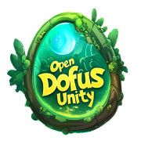
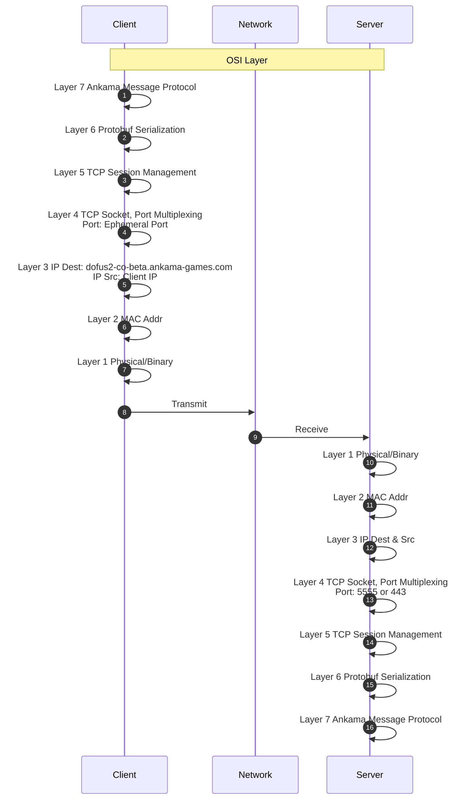

## Mise à Jour de la documentation

## Introduction

OpenDofusUnity est un wiki sur la personnalisation du jeu Dofus Unity.

## Sommaire

* Protocole réseau
* Assets du jeu

## Comment contribuer ?

Vous pouvez contribuer a ce wiki en créant un fork de celui-ci. Modifiez ce que vous souhaitez améliorer puis créez un Pull Request vers ce dépot. Les Pull Request seront ensuite relus et validé par les contributeurs direct du projet.

## Questions et erreurs
Si vous avez une question où que vous souhaiter signaler une erreur dans le wiki, vous pouvez créer également un message dans la section [Issues](https://github.com/OpenDofus/wiki/issues) avec les labels "Question" et "Erreur".

## Protocole Réseau

Ankama intègre son propre protocole Applicatif et utilise Protocol Buffer (Protobuf) pour la gestion des structures de données.

Le serveur Dofus Unity Beta est hebergé sur AWS: `dofus2-co-server-beta-client-23df9c5245171cb1.elb.eu-west-1.amazonaws.com`

## Fonctionnement de BepInEx 

BepInEx est un framework d'injection de mod pour les jeux développés via Unity. Il permet de modifier et d'étendre les fonctionnalités des jeux en ajoutant des plugins personnalisés.

### Fonctionnalités Principales

#### Injection de Code :

BepInEx permet aux utilisateurs d'injecter du code dans les jeux Unity en utilisant des plugins. Ces plugins peuvent interagir avec le code du jeu, modifier le comportement du jeu, ajouter de nouvelles fonctionnalités, ou corriger des bugs.

<ins>Le framework est conçu spécifiquement pour les jeux développés avec Unity (qui utilisent Mono comme moteur de script).</ins>

#### Gestion des Plugins :
Les utilisateurs peuvent ajouter des plugins à un jeu en plaçant les fichiers DLL du plugin dans le répertoire BepInEx/plugins. Ces plugins peuvent contenir des scripts en C# qui seront exécutés lorsque le jeu se lance.

#### Support des Mods :

BepInEx facilite l'utilisation de mods et de plugins en fournissant des outils pour les développeurs de mods. Les développeurs peuvent écrire des plugins pour ajouter ou modifier des fonctionnalités dans les jeux sans avoir à modifier les fichiers du jeu directement.
