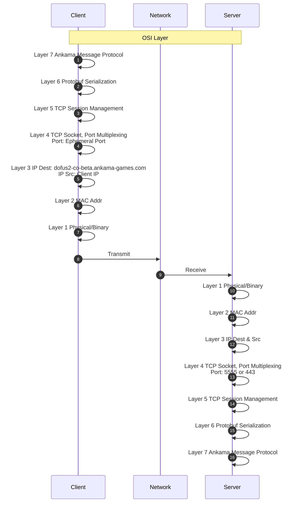

# Protocole Réseau



Ankama intègre son propre protocole Applicatif et utilise Protocol Buffer (Protobuf) pour la gestion des structures de données.

Le serveur Dofus Unity Beta est hebergé sur AWS: `dofus2-co-server-beta-client-23df9c5245171cb1.elb.eu-west-1.amazonaws.com`


## Fonctionnement de BepInEx 

BepInEx est un framework d'injection de mod pour les jeux développés via Unity. Il permet de modifier et d'étendre les fonctionnalités des jeux en ajoutant des plugins personnalisés.

### Fonctionnalités Principales

#### Injection de Code :

BepInEx permet aux utilisateurs d'injecter du code dans les jeux Unity en utilisant des plugins. Ces plugins peuvent interagir avec le code du jeu, modifier le comportement du jeu, ajouter de nouvelles fonctionnalités, ou corriger des bugs.

<ins>Le framework est conçu spécifiquement pour les jeux développés avec Unity (qui utilisent Mono comme moteur de script).</ins>

#### Gestion des Plugins :
Les utilisateurs peuvent ajouter des plugins à un jeu en plaçant les fichiers DLL du plugin dans le répertoire BepInEx/plugins. Ces plugins peuvent contenir des scripts en C# qui seront exécutés lorsque le jeu se lance.

#### Support des Mods :

BepInEx facilite l'utilisation de mods et de plugins en fournissant des outils pour les développeurs de mods. Les développeurs peuvent écrire des plugins pour ajouter ou modifier des fonctionnalités dans les jeux sans avoir à modifier les fichiers du jeu directement.


## Gestion des structures de données: Protobuf

Qu'est-ce que Protobuf ?
Protobuf est un format de sérialisation de données qui permet de définir des structures de données et de les encoder/décoder en un format binaire. Développé par Google, il est utilisé pour la communication entre différents services, le stockage de données, et dans d'autres situations nécessitant une représentation structurée des données.

<ins>Le format binaire de Protobuf est plus compact que les formats de sérialisation textuels, ce qui réduit la taille des données et améliore les performances en termes de vitesse de traitement et de bande passante.</ins>


### Définition des Données :

Les structures de données sont définies dans des fichiers de définition `(.proto)` en utilisant une syntaxe simple et déclarative. Ces fichiers décrivent les types de données, les champs, et les relations entre les champs.

#### Exemple de fichier .proto :
```proto
syntax = "proto3";

message Person {
  string name = 1;
  int32 id = 2;
  string email = 3;
}
```
### Sérialisation et Désérialisation :

* Sérialisation : Convertit des objets en un format binaire compact pour le stockage ou le transfert. Ce format est plus petit et plus rapide à traiter que les formats textuels comme JSON ou XML.
* Désérialisation : Reconvertit le format binaire en objets utilisables dans le code. Cela permet de lire et d'utiliser les données après les avoir reçues ou chargées.

Protobuf prend en charge plusieurs langages de programmation, y compris C++, Java, Python, C#, Go, et bien d'autres. Cela facilite l'échange de données entre systèmes développés dans différents langages.

### Rôle de TCP
TCP (Transmission Control Protocol) est un protocole de communication de niveau transport (Layer 4) qui gère la transmission fiable de flux de données entre deux machines. TCP assure que les paquets sont livrés dans l'ordre et sans perte, <ins>mais il ne segmente pas automatiquement les messages structurés comme ceux créés avec Protobuf</ins>. Ainsi, lorsqu'un message Protobuf est envoyé via TCP :

* Fragmentation et Réassemblage : TCP peut fragmenter les données du message en plusieurs paquets si elles sont trop grandes, mais il garantit que ces fragments seront réassemblés dans l'ordre avant de les fournir à l'application.

* Flux de données : Comme TCP traite un flux continu de données sans délimiter explicitement les messages, c'est à l'application de gérer la délimitation des messages.

#### Comment tout cela se relie ?
<ins>Préfixe de longueur avec Varint :</ins> Pour éviter toute confusion dans le flux de données reçu via TCP, chaque message Protobuf est souvent précédé par sa longueur encodée en Varint. Cela permet à l'application réceptrice de savoir où un message commence et finit dans le flux continu.

### Exemple de Déserialisation: Connexion au Serveur Beta


<details>
<summary>Message.proto</summary>

```proto
syntax = "proto3";

package com.ankama.dofus.server.connection.protocol;

message Message {
	oneof content {
		.com.ankama.dofus.server.connection.protocol.Request request = 1;
		.com.ankama.dofus.server.connection.protocol.Response response = 2;
		.com.ankama.dofus.server.connection.protocol.Event event = 3;
	}
}

message Request {
	string uuid = 1;
	oneof content {
		.com.ankama.dofus.server.connection.protocol.Ping ping = 2;
		.com.ankama.dofus.server.connection.protocol.IdentificationRequest identification = 3;
		.com.ankama.dofus.server.connection.protocol.SelectServerRequest selectServer = 4;
		.com.ankama.dofus.server.connection.protocol.ForceAccountRequest forceAccount = 5;
		.com.ankama.dofus.server.connection.protocol.ReleaseAccountRequest releaseAccount = 6;
		.com.ankama.dofus.server.connection.protocol.CharactersRequest characters_request = 7;
		.com.ankama.dofus.server.connection.protocol.FriendListRequest friend_list_request = 8;
		.com.ankama.dofus.server.connection.protocol.AcquaintanceServersRequest acquaintance_servers_request = 9;
	}
}

message Response {
	string uuid = 1;
	oneof content {
		.com.ankama.dofus.server.connection.protocol.Pong pong = 2;
		.com.ankama.dofus.server.connection.protocol.IdentificationResponse identification = 3;
		.com.ankama.dofus.server.connection.protocol.SelectServerResponse selectServer = 4;
		.com.ankama.dofus.server.connection.protocol.ForceAccountResponse forceAccount = 5;
		.com.ankama.dofus.server.connection.protocol.CharacterListResponse character_list_response = 6;
		.com.ankama.dofus.server.connection.protocol.FriendListResponse friend_list = 7;
		.com.ankama.dofus.server.connection.protocol.AcquaintanceServersResponse acquaintance_servers_response = 8;
	}
}

message Event {
	oneof content {
		.com.ankama.dofus.server.connection.protocol.Server server = 1;
		.com.ankama.dofus.server.connection.protocol.UpdateServerEvent update_server_event = 2;
	}
}

message Ping {
}

message Pong {
}

message UpdateServerEvent {
	.com.ankama.dofus.server.connection.protocol.ServerInformation serverInformation = 1;
}

message IdentificationRequest {
	string device_identifier = 1;
	string client_version = 5;
	oneof identification_type {
		.com.ankama.dofus.server.connection.protocol.TokenRequest tokenRequest = 3;
		.com.ankama.dofus.server.connection.protocol.LoginRequest loginRequest = 4;
	}
}

message TokenRequest {
	string token = 1;
	optional .com.ankama.dofus.server.connection.protocol.TokenRequest.Shield shield = 2;
	message Shield {
		int64 certificateId = 1;
		string certificateHash = 2;
	}

}

message LoginRequest {
	string login = 1;
}

message IdentificationResponse {
	oneof result {
		.com.ankama.dofus.server.connection.protocol.IdentificationResponse.Success success = 1;
		.com.ankama.dofus.server.connection.protocol.IdentificationResponse.Error error = 2;
	}
	message Success {
		int64 account_id = 1;
		string account_nickname = 2;
		string account_tag = 3;
		.com.ankama.dofus.server.connection.protocol.ServerList server_list = 4;
		string subscription_end_date = 5;
		.com.ankama.dofus.server.connection.protocol.IdentificationResponse.Success.Rights rights = 6;
		optional int32 fight_reconnection_server_id = 7;
		message Rights {
			bool show_force_account = 1;
			bool show_console = 2;
			bool unlimited_access = 3;
			bool infinite_subscription = 4;
			bool report = 5;
		}

	}

	message Error {
		.com.ankama.dofus.server.connection.protocol.IdentificationResponse.Error.Reason reason = 1;
		optional string ban_end_date = 2;
		optional string required_version = 3;
		enum Reason {
			UNKNOWN_AUTH_ERROR = 0;
			ALREADY_CONNECTED = 1;
			OTP_TIMEOUT = 2;
			BANNED = 3;
			INVALID_SHIELD_CERTIFICATE = 4;
			LOCKED = 5;
			CREDENTIALS_RESET = 6;
			WRONG_CREDENTIALS = 7;
			EMAIL_UNVALIDATED = 8;
			ANONYMOUS_IP_FORBIDDEN = 9;
			NICKNAME_REGISTRATION = 10;
			UNAUTHORIZED = 11;
			INVALID_CLIENT_VERSION = 12;
			OUTDATED_CLIENT_VERSION = 13;
		}

	}

}

message SelectServerRequest {
	int32 server = 1;
}

message SelectServerResponse {
	oneof result {
		.com.ankama.dofus.server.connection.protocol.SelectServerResponse.Success success = 1;
		.com.ankama.dofus.server.connection.protocol.SelectServerResponse.Error error = 2;
	}
	message Success {
		string token = 1;
		string host = 2;
		repeated int32 ports = 3;
	}

	enum Error {
		REFUSED = 0;
		SUBSCRIBER_ONLY = 1;
		SINGLE_ACCOUNT_VERIFIED_ONLY = 2;
		MAINTENANCE = 3;
	}

}

message ServerList {
	repeated .com.ankama.dofus.server.connection.protocol.ServerInformation servers = 1;
	int32 max_slot_by_type = 2;
}

message ServerInformation {
	.com.ankama.dofus.server.connection.protocol.Server server = 1;
	.com.ankama.dofus.server.connection.protocol.ServerInformation.Accessibility accessibility = 2;
	enum Accessibility {
		ACCESSIBLE = 0;
		SUBSCRIBE_RESTRICTION = 1;
		MONO_ACCOUNT_RESTRICTION = 2;
	}

}

message Server {
	int32 id = 1;
	.com.ankama.dofus.server.connection.protocol.Server.Status status = 2;
	bool limited = 3;
	int32 type = 4;
	bool mono_account = 5;
	enum Status {
		OFFLINE = 0;
		ONLINE = 1;
		MAINTENANCE = 2;
	}

}

message ForceAccountRequest {
	int64 account_id = 1;
}

message ForceAccountResponse {
	oneof content {
		.com.ankama.dofus.server.connection.protocol.ForceAccountStatus success = 2;
		.com.ankama.dofus.server.connection.protocol.ForceAccountError error = 3;
	}
}

message ForceAccountStatus {
	bool is_forced = 1;
	int64 forced_account_id = 2;
	string forced_account_nickname = 3;
	string forced_account_tag = 4;
	.com.ankama.dofus.server.connection.protocol.ServerList server_list = 5;
}

message ForceAccountError {
}

message ReleaseAccountRequest {
}

message CharactersRequest {
}

message CharacterListResponse {
	repeated .com.ankama.dofus.server.connection.protocol.CharacterListResponse.CharacterInformation character_information = 1;
	message CharacterInformation {
		string name = 1;
		.com.ankama.dofus.server.connection.protocol.CharacterListResponse.CharacterInformation.Breed breed = 2;
		.com.ankama.dofus.server.connection.protocol.CharacterListResponse.CharacterInformation.Gender gender = 3;
		int32 level = 4;
		string last_connection_date = 5;
		int32 server_id = 6;
		enum Gender {
			MALE = 0;
			FEMALE = 1;
		}

		enum Breed {
			FECA = 0;
			OSAMODAS = 1;
			ENUTROF = 2;
			SRAM = 3;
			XELOR = 4;
			ECAFLIP = 5;
			ENIRIPSA = 6;
			IOP = 7;
			CRA = 8;
			SADIDA = 9;
			SACRIER = 10;
			PANDAWA = 11;
			ROGUE = 12;
			MASQUERAIDER = 13;
			FOGGERNAUTS = 14;
			ELIOTROPE = 15;
			HUPPERMAGE = 16;
			OUGINAK = 17;
			FORGELANCE = 18;
		}

	}

}

message FriendListRequest {
}

message FriendListResponse {
	oneof result {
		.com.ankama.dofus.server.connection.protocol.FriendListResponse.FriendList friends = 1;
		.com.ankama.dofus.server.connection.protocol.FriendListResponse.Error error = 2;
	}
	message FriendList {
		repeated .com.ankama.dofus.server.connection.protocol.FriendListResponse.FriendList.Friend friends = 1;
		message Friend {
			string account_name = 1;
			string account_tag = 2;
			repeated int32 servers = 3;
		}

	}

	enum Error {
		UNKNOWN = 0;
		FLOODING = 1;
	}

}

message AcquaintanceServersRequest {
	string name = 1;
	string tag = 2;
}

message AcquaintanceServersResponse {
	oneof result {
		.com.ankama.dofus.server.connection.protocol.AcquaintanceServersResponse.Servers servers = 1;
		.com.ankama.dofus.server.connection.protocol.AcquaintanceServersResponse.Error error = 2;
	}
	message Servers {
		repeated int32 servers = 1;
	}

	message Error {
		.com.ankama.dofus.server.connection.protocol.AcquaintanceServersResponse.Error.Reason reason = 1;
		enum Reason {
			UNKNOWN = 0;
			NO_RESULT = 1;
			FLOOD = 2;
			INVALID_ACCOUNT = 3;
		}

	}

}
```
</details>

<details>
<summary>HexDump</summary>

```
670a650a01301a600a28373031306462323964373130636465326562633730626536363932356135616134613435616361371a280a2432363665653631362d373063622d343936652d623765392d63316637663031366461313312002a0a322e37332e31372e3138
```

</details>

<details>
<summary>Python ProtoBuf Deserializer</summary>

```python
import message_pb2  # Assurez-vous que ce fichier est généré dans le même répertoire
from google.protobuf.internal.decoder import _DecodeVarint


def decode_protobuf(data):
    message = message_pb2.Message()
    message.ParseFromString(data)
    return message

def decode_varint_size(data):
    size, new_pos = _DecodeVarint(data, 0)
    return size, new_pos

def main():
    hex_data = ("670a650a01301a600a28373031306462323964373130636465326562633730626536363932356135616134613435616361371a280a2432363665653631362d373063622d343936652d623765392d63316637663031366461313312002a0a322e37332e31372e3138")
    binary_data = bytes.fromhex(hex_data)
    print("Binary data:", binary_data)

    # Décoder la taille du message
    size, pos = decode_varint_size(binary_data)
    print(f"Message size: {size} bytes")
    print(f"Position after decoding varint: {pos}")

    # Extraire le message en utilisant la taille et le décaler
    protobuf_message = binary_data[pos:pos+size]

    # Décoder le message
    message = decode_protobuf(protobuf_message)
    print("Decoded message:")
    print(message)

if __name__ == "__main__":
    main()
```

</details>

### Output
```
Binary data: b'g\ne\n\x010\x1a`\n(7010db29d710cde2ebc70be66925a5aa4a45aca7\x1a(\n$266ee616-70cb-496e-b7e9-c1f7f016da13\x12\x00*\n2.73.17.18'
Message size: 103 bytes
Position after decoding varint: 1
Decoded message:
request {
  uuid: "0"
  identification {
    device_identifier: "7010db29d710cde2ebc70be66925a5aa4a45aca7"
    tokenRequest {
      token: "266ee616-70cb-496e-b7e9-c1f7f016da13"
      shield {
      }
    }
    client_version: "2.73.17.18"
  }
}
```
