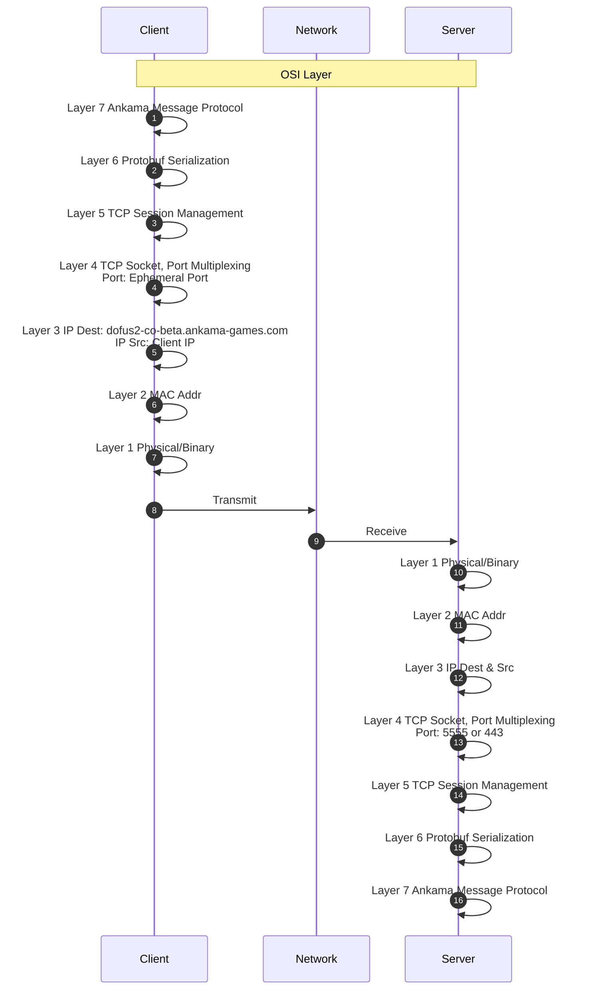

# Protocole Réseau



Ankama intègre son propre protocole Applicatif et utilise Protocol Buffer (Protobuf) pour la gestion des structures de données.

Le serveur Dofus Unity Beta est hebergé sur AWS: `dofus2-co-server-beta-client-23df9c5245171cb1.elb.eu-west-1.amazonaws.com`


## Fonctionnement de BepInEx 

BepInEx est un framework d'injection de mod pour les jeux développés via Unity. Il permet de modifier et d'étendre les fonctionnalités des jeux en ajoutant des plugins personnalisés.

### Fonctionnalités Principales

#### Injection de Code :

BepInEx permet aux utilisateurs d'injecter du code dans les jeux Unity en utilisant des plugins. Ces plugins peuvent interagir avec le code du jeu, modifier le comportement du jeu, ajouter de nouvelles fonctionnalités, ou corriger des bugs.

<ins>Le framework est conçu spécifiquement pour les jeux développés avec Unity (qui utilisent Mono comme moteur de script).</ins>

#### Gestion des Plugins :
Les utilisateurs peuvent ajouter des plugins à un jeu en plaçant les fichiers DLL du plugin dans le répertoire BepInEx/plugins. Ces plugins peuvent contenir des scripts en C# qui seront exécutés lorsque le jeu se lance.

#### Support des Mods :

BepInEx facilite l'utilisation de mods et de plugins en fournissant des outils pour les développeurs de mods. Les développeurs peuvent écrire des plugins pour ajouter ou modifier des fonctionnalités dans les jeux sans avoir à modifier les fichiers du jeu directement.


## Gestion des structures de données: Protobuf

Qu'est-ce que Protobuf ?
Protobuf est un format de sérialisation de données qui permet de définir des structures de données et de les encoder/décoder en un format binaire. Développé par Google, il est utilisé pour la communication entre différents services, le stockage de données, et dans d'autres situations nécessitant une représentation structurée des données.

<ins>Le format binaire de Protobuf est plus compact que les formats de sérialisation textuels, ce qui réduit la taille des données et améliore les performances en termes de vitesse de traitement et de bande passante.</ins>


### Définition des Données :

Les structures de données sont définies dans des fichiers de définition `(.proto)` en utilisant une syntaxe simple et déclarative. Ces fichiers décrivent les types de données, les champs, et les relations entre les champs.

#### Exemple de fichier .proto :
```proto
syntax = "proto3";

message Person {
  string name = 1;
  int32 id = 2;
  string email = 3;
}
```
### Sérialisation et Désérialisation :

* Sérialisation : Convertit des objets en un format binaire compact pour le stockage ou le transfert. Ce format est plus petit et plus rapide à traiter que les formats textuels comme JSON ou XML.
* Désérialisation : Reconvertit le format binaire en objets utilisables dans le code. Cela permet de lire et d'utiliser les données après les avoir reçues ou chargées.

Protobuf prend en charge plusieurs langages de programmation, y compris C++, Java, Python, C#, Go, et bien d'autres. Cela facilite l'échange de données entre systèmes développés dans différents langages.

### Rôle de TCP
TCP (Transmission Control Protocol) est un protocole de communication de niveau transport (Layer 4) qui gère la transmission fiable de flux de données entre deux machines. TCP assure que les paquets sont livrés dans l'ordre et sans perte, <ins>mais il ne segmente pas automatiquement les messages structurés comme ceux créés avec Protobuf</ins>. Ainsi, lorsqu'un message Protobuf est envoyé via TCP :

* Fragmentation et Réassemblage : TCP peut fragmenter les données du message en plusieurs paquets si elles sont trop grandes, mais il garantit que ces fragments seront réassemblés dans l'ordre avant de les fournir à l'application réceptrice.

* Flux de données : Comme TCP traite un flux continu de données sans délimiter explicitement les messages, c'est à l'application de gérer la délimitation des messages.

#### Comment tout cela se relie ?
<ins>Préfixe de longueur avec Varint :</ins> Pour éviter toute confusion dans le flux de données reçu via TCP, chaque message Protobuf est souvent précédé par sa longueur encodée en Varint. Cela permet à l'application réceptrice de savoir où un message commence et finit dans le flux continu.
